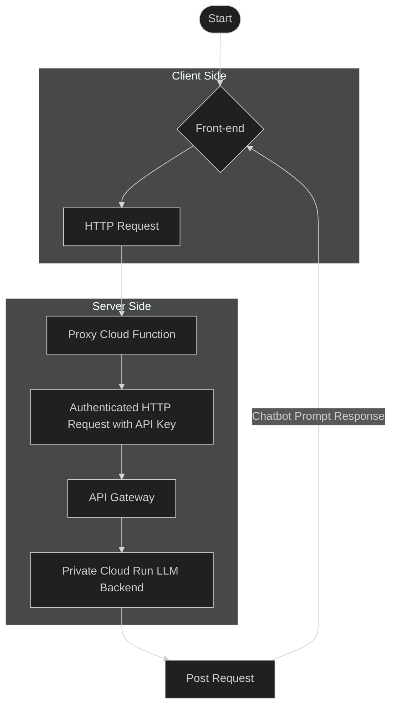
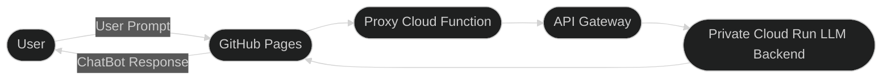

# Deploying TinyLlama with FastAPI on Cloud Run (Private) & Connecting via API Gateway
This guide details the steps to deploy a custom TinyLlama FastAPI application as a private service on Google Cloud Run (CPU-based) and securely expose it to a remote front-end (e.g., hosted on GitHub Pages) using API Gateway and an API Key.
Overall Architecture:

1. Front-end (e.g., GitHub Pages): User interacts with your chat interface. JavaScript makes API calls to API Gateway.
2. API Gateway: Public-facing entry point. Authenticates requests using an API Key. Routes valid requests to your private Cloud Run service.
3. Cloud Run (Private LLM Backend): Runs your FastAPI application with the TinyLlama model. Only callable by authenticated identities (in this case, API Gateway's service account).

## Phase 1: Prepare Your TinyLlama Backend Application
1. File Structure
Ensure you have a directory (e.g., ```tinyllama-backend```) with the following files:

- ```main.py```: Your FastAPI application code using the Hugging Face pipeline for TinyLlama. Configure CORS to allow your GitHub Pages origin (e.g., ```https://YOUR_GITHUB_USERNAME.github.io```).
```python
# Inside main.py
origins = [
    "https://YOUR_GITHUB_USERNAME.github.io", # Replace with your actual GitHub Pages URL
]

app.add_middleware(
    CORSMiddleware,
    allow_origins=origins,
    allow_credentials=True,
    allow_methods=["POST", "OPTIONS"],
    allow_headers=["Content-Type", "Authorization", "X-API-Key"], # X-API-Key for the API Key
)
```
Replace ```YOUR_GITHUB_USERNAME.github.io``` with your actual GitHub Pages URL.

- ```Dockerfile```: Defines how to build the container image for your FastAPI application (installs Python, dependencies, copies code, and runs Uvicorn).
- ```requirements.txt```: Lists all Python dependencies (e.g., ```fastapi```, ```uvicorn```, ```torch```, ```transformers```, ```python-dotenv```, ```psutil```, ```sentencepiece```, ```accelerate```).

## Phase 2: Deploy TinyLlama Backend as a Private Cloud Run Service
1. Setup Google Cloud CLI (gcloud)

- Install ```gcloud``` if you haven't: Install gcloud CLI
- Authenticate and configure your project:
```
gcloud auth login
gcloud auth application-default login
export PROJECT_ID=your-gcp-project-id # Replace with your Project ID
gcloud config set project $PROJECT_ID
```

- Enable necessary APIs:
```
gcloud services enable run.googleapis.com \
    cloudbuild.googleapis.com \
    iam.googleapis.com \
    iamcredentials.googleapis.com \
    apigateway.googleapis.com \
    servicecontrol.googleapis.com \
    servicemanagement.googleapis.com
```
2. Build Your Docker Image using Cloud Build
Navigate to your tinyllama-backend directory in your terminal.
```
# Make sure you are in the directory containing your Dockerfile, main.py, etc.
gcloud builds submit --tag gcr.io/$PROJECT_ID/tinylama-llm-backend:v1
```
This builds the image and pushes it to Google Container Registry (GCR).
3. Deploy to Cloud Run as a Private Service
```
export REGION=us-central1 # Or your preferred region
export CLOUD_RUN_SERVICE_NAME=tinylama-llm-backend-private

gcloud run deploy $CLOUD_RUN_SERVICE_NAME \
    --image=gcr.io/$PROJECT_ID/tinylama-llm-backend:v1 \
    --platform=managed \
    --region=$REGION \
    --cpu=1 \
    --memory=2Gi \
    --port=8080 \
    --no-allow-unauthenticated \
    --min-instances=0 \
    --timeout=300s
```

- ```--no-allow-unauthenticated:``` This is critical. It makes your service private.
- Note the service URL output by this command. You'll need it for the API Gateway config. It will look like 
```https://[SERVICE_NAME]-[PROJECT_HASH]-[REGION_CODE].a.run.app.```
# Phase 3: Set Up API Gateway
1. Create a Service Account for API Gateway
This service account will be used by API Gateway to securely invoke your private Cloud Run service.
```
export APIGW_INVOKER_SA_NAME=tinylama-apigw-invoker
export APIGW_INVOKER_SA_EMAIL=$APIGW_INVOKER_SA_NAME@$PROJECT_ID.iam.gserviceaccount.com

gcloud iam service-accounts create $APIGW_INVOKER_SA_NAME \
    --display-name="TinyLlama API Gateway Invoker"
```
2. Grant "Cloud Run Invoker" Role to the Service Account
Allow the new service account to call your private Cloud Run service.
```
gcloud run services add-iam-policy-binding $CLOUD_RUN_SERVICE_NAME \
    --member="serviceAccount:$APIGW_INVOKER_SA_EMAIL" \
    --role="roles/run.invoker" \
    --region=$REGION
```
3. Create an API Gateway OpenAPI Specification
Create a file named ```tinylama-openapi-spec.yaml```. 
Replace ```YOUR_PRIVATE_CLOUD_RUN_SERVICE_URL``` with the URL of your deployed private Cloud Run service (from Phase 2).
```yaml
# tinylama-openapi-spec.yaml
swagger: '2.0' # Using Swagger 2.0
info:
  title: TinyLlama Chat API
  description: API Gateway for TinyLlama Chatbot on Cloud Run
  version: '1.0.0'
schemes:
  - https
produces:
  - application/json
paths:
  /chat: # This is the public path your front-end will call
    post:
      summary: Proxy to TinyLlama chat backend
      operationId: chatProxy
      x-google-backend:
        address: YOUR_PRIVATE_CLOUD_RUN_SERVICE_URL # e.g., https://tinylama-llm-backend-private-xyz.a.run.app
        path_translation: APPEND_PATH_TO_ADDRESS # Appends /chat to the backend address
        jwt_audience: YOUR_PRIVATE_CLOUD_RUN_SERVICE_URL # Should be the same as address for Cloud Run
      consumes: # Specify request content type for Swagger 2.0
        - application/json
      parameters: # Define request body for Swagger 2.0
        - name: body
          in: body
          required: true
          description: Chat request payload
          schema:
            type: object
            required:
              - user_prompt
            properties:
              user_prompt:
                type: string
                example: "Hello, how are you?"
              conversation_history:
                type: array
                items:
                  type: object
                  properties:
                    role:
                      type: string
                      example: "user"
                    content:
                      type: string
                      example: "Previous message"
                example: [{"role": "user", "content": "Hi"}]
      responses:
        '200':
          description: A successful response
          schema:
            type: object # Define your expected response structure here
        # Add other responses like 400, 403, 500 etc.
      security:
        - api_key_security: [] # Reference the security scheme defined below
securityDefinitions: # Swagger 2.0 uses 'securityDefinitions'
  api_key_security: # Arbitrary name for the security scheme
    type: apiKey
    name: x-api-key # Standard header name for API keys
    in: header


```
- Important: The ```x-google-backend.address``` should be the full HTTPS URL of your private Cloud Run service.
- The ```x-google-backend.jwt_audience``` should also be this same URL for Cloud Run backends.

4. Create an API Config from the OpenAPI Specification
```
export API_ID=tinylama-chat-api
export API_CONFIG_ID=tinylama-chat-api-config-v1

gcloud api-gateway api-configs create $API_CONFIG_ID \
  --api=$API_ID \
  --openapi-spec=tinylama-openapi-spec.yaml \
  --project=$PROJECT_ID \
  --backend-auth-service-account=$APIGW_INVOKER_SA_EMAIL
```

- ```--backend-auth-service-account:``` This tells API Gateway to use the specified service account to authenticate to your backend Cloud Run service.

5. Create the API Gateway
```
export GATEWAY_ID=tinylama-chat-gateway

gcloud api-gateway gateways create $GATEWAY_ID \
  --api=$API_ID \
  --api-config=$API_CONFIG_ID \
  --location=$REGION \
  --project=$PROJECT_ID
```

This step can take a few minutes. After it's complete, it will output a Gateway URL (e.g., ```https://tinylama-chat-gateway-xxxx.nw.gateway.dev```). This is the URL your front-end will use. NOTE!! This does not always happen and you might need to use the following command to see it.
```
gcloud api-gateway gateways describe $GATEWAY_ID \
    --location=$REGION \
    --project=$PROJECT_ID \
    --format="value(defaultHostname)"
```
## Phase 4: Secure API Gateway with an API Key
1. Create an API Key
- Go to Google Cloud Console -> "APIs & Services" -> "Credentials".
- Click "+ CREATE CREDENTIALS" -> "API key".
- Copy the generated API key immediately and store it securely. Let's call it ```YOUR_GENERATED_API_KEY```.

2. Restrict the API Key
- Find the API key you just created in the list. Click on its name (or the pencil icon) to edit it.
- Under "API restrictions":
    - Select "Restrict key".
    - In the "Select APIs" dropdown, find and select your API Gateway API (e.g., "TinyLlama Chat API" or the service name associated with ```tinylama-chat-api.apigateway.YOUR_PROJECT_ID.cloud.goog```).

- Under "Application restrictions":
    - Select "HTTP referrers (web sites)".
    - Click "+ ADD AN ITEM".
    - Enter your proxy URL (e.g., ```https://YOUR_GITHUB_USERNAME.github.io/*```). The /* at the end acts as a wildcard for paths within that domain.
- Click "Save".

---

# Python Proxy Cloud Function for Secure API Gateway Access
This guide explains how to set up and deploy a Python-based Google Cloud Function that acts as a secure proxy between your static front-end (e.g., hosted on GitHub Pages) and your API Key-protected Google Cloud API Gateway. This approach avoids exposing your API Gateway API Key directly in client-side JavaScript.

## Purpose:

The primary goal of this proxy function is to securely store and use your API Gateway API Key.

1. Your front-end makes an unauthenticated (or differently authenticated) request to this Cloud Function.

2. This Cloud Function receives the request, retrieves the API Gateway URL and API Key from its secure environment variables.

3. It then forwards the request to your actual API Gateway, adding the x-api-key header.

4. The response from API Gateway is then relayed back to your front-end.

## Architecture:


## Phase 1: Prepare the Proxy Cloud Function Code
1. Create a Directory:
Create a new directory for your Cloud Function code, for example, ```chat-proxy-function```.

```forwardapiproxy.py``` File:
Inside the ```chat-proxy-function``` directory, create a file named ```forwardapiproxy.py``` with the following Python code:
```
# main.py for Google Cloud Function (Python 3.9+ recommended)

import functions_framework
import requests # For making HTTP requests
import os # For accessing environment variables
import json

# --- Environment Variables (to be set in Cloud Function deployment) ---
# These will be securely set when you deploy the Cloud Function.
TARGET_API_GATEWAY_URL = os.environ.get('API_GATEWAY_URL')
TARGET_API_KEY = os.environ.get('API_GATEWAY_API_KEY')
ALLOWED_CORS_ORIGIN = os.environ.get('ALLOWED_CORS_ORIGIN') # e.g., "https://your-username.github.io"


@functions_framework.http
def chat_proxy(request):
    """
    HTTP Cloud Function to proxy chat requests to a secured API Gateway.
    It adds an API key to the outgoing request.
    """

    # --- Set CORS headers for preflight and actual requests ---
    # This allows requests from your specified front-end origin.
    headers = {
        'Access-Control-Allow-Origin': ALLOWED_CORS_ORIGIN if ALLOWED_CORS_ORIGIN else '*', # Default to '*' if not set, but specific is better
        'Access-Control-Allow-Methods': 'POST, OPTIONS',
        'Access-Control-Allow-Headers': 'Content-Type',
        'Access-Control-Max-Age': '3600', # Cache preflight response for 1 hour
        'Content-Type': 'application/json' # Default response content type
    }

    # Handle CORS preflight requests (OPTIONS method)
    if request.method == 'OPTIONS':
        return ('', 204, headers)

    # --- Check for required environment variables ---
    if not TARGET_API_GATEWAY_URL or not TARGET_API_KEY:
        print("CRITICAL ERROR: API_GATEWAY_URL or API_GATEWAY_API_KEY environment variable not set.")
        # Avoid leaking internal config details in the error message to the client
        return (json.dumps({"error": "Server configuration error. Please contact administrator."}), 500, headers)

    if not ALLOWED_CORS_ORIGIN:
        print("WARNING: ALLOWED_CORS_ORIGIN environment variable not set. CORS might not work as expected or be too permissive.")
        # For security, you might choose to fail if this isn't set to a specific domain
        # headers['Access-Control-Allow-Origin'] = '*' # Or a default restrictive value

    # --- Ensure it's a POST request for actual chat ---
    if request.method != 'POST':
        return (json.dumps({"error": "Method not allowed. Only POST is accepted for this endpoint."}), 405, headers)

    # --- Get JSON payload from the incoming request ---
    try:
        incoming_payload = request.get_json(silent=True)
        if incoming_payload is None:
            # This can happen if Content-Type header is missing or not application/json
            print("Error: Invalid or missing JSON payload from client.")
            return (json.dumps({"error": "Invalid JSON payload or Content-Type header not set to application/json."}), 400, headers)
    except Exception as e:
        print(f"Error parsing incoming JSON: {e}")
        return (json.dumps({"error": "Could not parse request body as JSON."}), 400, headers)

    # --- Prepare headers for the request to API Gateway ---
    outgoing_headers = {
        'Content-Type': 'application/json',
        'x-api-key': TARGET_API_KEY
    }

    # --- Forward the request to the actual API Gateway ---
    try:
        print(f"Proxying request for client to: {TARGET_API_GATEWAY_URL}")
        response_from_gateway = requests.post(
            TARGET_API_GATEWAY_URL,
            json=incoming_payload, # Send the same payload received
            headers=outgoing_headers,
            timeout=290 # Slightly less than Cloud Function timeout (default 300s for HTTP gen2, 60s for gen1)
        )
        # Raise an exception for HTTP error codes (4xx or 5xx) from the gateway
        response_from_gateway.raise_for_status()

        # Relay the response from API Gateway back to the client
        gateway_content_type = response_from_gateway.headers.get('Content-Type', 'application/json')
        headers['Content-Type'] = gateway_content_type # Update response header with gateway's content type

        # Try to return JSON if that's what the gateway sent, otherwise text
        try:
            response_data = response_from_gateway.json()
            return (json.dumps(response_data), response_from_gateway.status_code, headers)
        except ValueError: # If response from gateway is not JSON
            print("Warning: Response from API Gateway was not valid JSON. Returning as raw text.")
            if 'application/json' in headers['Content-Type']: # Correct content type if it's not JSON
                 headers['Content-Type'] = 'text/plain'
            return (response_from_gateway.text, response_from_gateway.status_code, headers)

    except requests.exceptions.HTTPError as e:
        # Error came from API Gateway (e.g., 403 Forbidden if API key is wrong, 404 if path wrong, 5xx from backend)
        print(f"HTTP error from API Gateway: {e.response.status_code} - {e.response.text}")
        error_payload_to_client = {"error": f"Error communicating with backend service (Status: {e.response.status_code})."}
        try:
            # Try to relay the gateway's JSON error response if available
            error_payload_to_client = e.response.json()
        except ValueError:
            error_payload_to_client["detail"] = e.response.text # Add raw text if not JSON

        # Ensure the status code passed back to the client is the one from the gateway
        return (json.dumps(error_payload_to_client), e.response.status_code, headers)

    except requests.exceptions.RequestException as e:
        # Network error connecting to API Gateway (e.g., DNS failure, connection timeout)
        print(f"Network error calling API Gateway: {e}")
        return (json.dumps({"error": f"Could not connect to the backend service. Please try again later."}), 503, headers) # 503 Service Unavailable

    except Exception as e:
        # Catch-all for any other unexpected errors in the proxy function itself
        print(f"An unexpected error occurred in the proxy function: {e}")
        return (json.dumps({"error": "An internal server error occurred in the proxy."}), 500, headers)
```

3. ```requirements.txt``` File:
Inside the ```chat-proxy-function``` directory, create a file named ```requirements.txt``` with the following content:

```
functions-framework
requests
```

## Phase 2: Deploy the Proxy Cloud Function
1. Prerequisites:
  - Google Cloud SDK (```gcloud```) installed and authenticated.
  - Your Google Cloud Project ID set (```gcloud config set project YOUR_PROJECT_ID```).
  - The following APIs enabled in your project:
    - Cloud Functions API (```cloudfunctions.googleapis.com```)
    - Cloud Build API (```cloudbuild.googleapis.com```) (for building the function)
    - IAM API (```iam.googleapis.com```) (if managing permissions via gcloud)
    - Artifact Registry API (```artifactregistry.googleapis.com```) (Cloud Functions Gen2 stores images here)

2. Set Environment Variables for Deployment:
Open your terminal and set these variables. Replace the placeholder values with your actual data.

```
export FUNCTION_NAME=chat-proxy-llm # Choose a name for your Cloud Function
export GCF_REGION=us-central1      # Choose a region for your Cloud Function (e.g., us-central1)

# IMPORTANT: Replace with YOUR actual GitHub Pages origin
export YOUR_GITHUB_PAGES_ORIGIN="https://YOUR_GITHUB_USERNAME.github.io" 

# IMPORTANT: Replace with YOUR actual API Gateway URL (including the /chat path)
export YOUR_API_GATEWAY_URL="https://YOUR_API_GATEWAY_HOSTNAME/chat" 

# IMPORTANT: Replace with YOUR actual API Key for API Gateway
export YOUR_API_GATEWAY_API_KEY="YOUR_ACTUAL_API_KEY_VALUE" 
```

3. Deploy the Function:
Navigate to your chat-proxy-function directory (containing main.py and requirements.txt).
Run the following command:

```
gcloud functions deploy $FUNCTION_NAME \
    --gen2 \
    --runtime python311 # Or python39, python310, python312 as per your preference/testing
    --region $GCF_REGION \
    --source . \
    --entry-point chat_proxy \
    --trigger-http \
    --allow-unauthenticated \
    --set-env-vars API_GATEWAY_URL="$YOUR_API_GATEWAY_URL",API_GATEWAY_API_KEY="$YOUR_API_GATEWAY_API_KEY",ALLOWED_CORS_ORIGIN="$YOUR_GITHUB_PAGES_ORIGIN"

```
- ```--gen2```: Deploys as a 2nd generation Cloud Function (recommended).

- ```--runtime```: Specifies the Python runtime.

- ```--entry-point chat_proxy```: Tells Cloud Functions which Python function in main.py to execute.

- ```--trigger-http:``` Makes it an HTTP-triggered function.

- ```--allow-unauthenticated:``` This is necessary so your GitHub Pages front-end (which doesn't have Google Cloud credentials) can call this proxy function. The security for accessing your actual LLM backend is handled by the API Key that this proxy function uses to call API Gateway.

- ```--set-env-vars```: Securely sets the API Gateway URL, API Key, and allowed CORS origin as environment variables for your Cloud Function. These values will not be in your code repository.

4. Get the Trigger URL:
After successful deployment, ```gcloud``` will output an HTTPS Trigger URL for your Cloud Function. It will look something like:
```https://FUNCTION_NAME-PROJECT_HASH-REGION.a.run.app``` (for Gen2) or
```https://REGION-PROJECT_ID.cloudfunctions.net/FUNCTION_NAME``` (for Gen1, though we used Gen2).
Copy this URL. This is what your front-end will call.

## Phase 3: Update Your Front-end (index.html)
1. Modify JavaScript:
In your ```index.html``` file, update the ```sendMessageToBackend``` function:

- Change the ```gatewayApiUrl``` variable to point to your new Cloud Function Trigger URL.

- Remove the ```apiKey``` constant and the ```x-api-key header``` from the ```fetch``` call.

```
// Inside your index.html <script> tag

async function sendMessageToBackend(message) {
    showThinkingIndicator();

    // IMPORTANT: Replace with your Cloud Function's HTTPS Trigger URL
    const proxyFunctionUrl = 'https://YOUR_CLOUD_FUNCTION_TRIGGER_URL'; // <<< REPLACE THIS

    const payload = {
        user_prompt: message,
        conversation_history: currentChatMessages 
    };

    try {
        const response = await fetch(proxyFunctionUrl, { // Call the proxy function
            method: 'POST',
            headers: {
                'Content-Type': 'application/json'
                // NO 'x-api-key' header here; the proxy function handles it
            },
            body: JSON.stringify(payload)
        });

        hideThinkingIndicator(); 

        if (!response.ok) {
            let errorDetail = `Request failed with status ${response.status}`;
            try {
                const errorData = await response.json();
                // Check for common error structures from your proxy or the proxied service
                if (errorData && errorData.error) {
                     errorDetail = typeof errorData.error === 'string' ? errorData.error : JSON.stringify(errorData.error);
                } else if (errorData && errorData.message) { 
                    errorDetail = errorData.message;
                } else if (errorData && errorData.detail) {
                     errorDetail = typeof errorData.detail === 'string' ? errorData.detail : JSON.stringify(errorData.detail);
                }
                console.error('Error from proxy/backend:', response.status, errorData);
            } catch (e) {
                console.error('Could not parse error JSON from proxy:', e);
            }
            _renderBotMessage(`My apologies, I encountered an issue: ${errorDetail}`);
            currentChatMessages.push({ role: 'assistant', content: `My apologies, I encountered an issue: ${errorDetail}` });
            saveChatHistory();
            return;
        }

        const data = await response.json();

        // Process 'data' as before (it's the response from your LLM backend, relayed by the proxy)
        if (data.error) {
            console.error('Backend application returned an error:', data.error);
            _renderBotMessage(`An error occurred: ${data.error}`);
            currentChatMessages.push({ role: 'assistant', content: `An error occurred: ${data.error}` });
        } else if (data.bot_response) {
            if (data.updated_conversation_history) {
                currentChatMessages = data.updated_conversation_history.map(msg => ({
                    role: msg.role,
                    content: msg.content
                }));
                const lastMessage = currentChatMessages[currentChatMessages.length - 1];
                if (lastMessage && lastMessage.role === 'assistant') {
                    _renderBotMessage(lastMessage.content); 
                } else {
                    _renderBotMessage(data.bot_response); 
                    currentChatMessages.push({ role: 'assistant', content: data.bot_response });
                }
            } else {
                _renderBotMessage(data.bot_response);
                currentChatMessages.push({ role: 'assistant', content: data.bot_response });
            }
        } else {
            _renderBotMessage("Received an unexpected response from the AI.");
            currentChatMessages.push({ role: 'assistant', content: "Received an unexpected response from the AI." });
        }
        saveChatHistory();

    } catch (error) { // Network errors when calling the proxy function
        console.error('Error sending message to proxy function:', error);
        hideThinkingIndicator();
        _renderBotMessage("My apologies, I couldn't connect. Please check your connection and try again.");
        currentChatMessages.push({ role: 'assistant', content: "My apologies, I couldn't connect. Please check your connection and try again." });
        saveChatHistory();
    }
}
```

2. Deploy Front-end Changes:
Commit and push your updated ```index.html``` to GitHub Pages.

## Phase 4: Testing
1. Open your GitHub Pages site.

2. Try sending messages. The requests should now go:

3. If issues arise, check:
  - Browser developer console (for front-end errors or CORS issues with the Cloud Function).
  - Logs for your Proxy Cloud Function in Google Cloud Console (Functions -> Select your function -> Logs).
  - Logs for your API Gateway.
  - Logs for your private Cloud Run LLM backend service.

This setup provides a more secure way to handle your API Gateway API Key by keeping it out of the client-side code.


## Phase 5: Testing

1. Open your GitHub Pages site (or wherever your front-end is hosted).
2. Try sending messages through the chat interface.
3. Check the browser's developer console for any errors (Network tab for API call status, Console tab for JavaScript errors).
4. If issues arise, check the logs for API Gateway and your private Cloud Run service in the Google Cloud Console.

## Phase 6: Resource Clean Up (Optional)
If you want to remove the deployed resources to avoid ongoing costs:
1. Delete API Gateway:
```
gcloud api-gateway gateways delete $GATEWAY_ID --location=$REGION --project=$PROJECT_ID --quiet
```

2. Delete API Config
```
gcloud api-gateway api-configs delete $API_CONFIG_ID --api=$API_ID --project=$PROJECT_ID --quiet
```

3. Delete API Definition (Optional)
```
gcloud api-gateway apis delete $API_ID --project=$PROJECT_ID --quiet
```
4. Delete API Key
Go to GCP Console -> APIs & Services -> Credentials. Find your API key and delete it.
5. Delete Cloud Run Service
```
gcloud run services delete $CLOUD_RUN_SERVICE_NAME --region=$REGION --project=$PROJECT_ID --quiet
```
6. Delete Container Image
```
gcloud container images delete gcr.io/$PROJECT_ID/tinylama-llm-backend:v1 --force-delete-tags --quiet
```
7. Delete Service Account
```
gcloud iam service-accounts delete $APIGW_INVOKER_SA_EMAIL --project=$PROJECT_ID --quiet
```

This provides a secure and robust way to deploy your TinyLlama backend and connect it to your front-end. Remember to replace all placeholder values (like ```YOUR_GITHUB_USERNAME```, ```your-gcp-project-id```, ```YOUR_PRIVATE_CLOUD_RUN_SERVICE_URL```, ```YOUR_API_GATEWAY_URL```, ```YOUR_GENERATED_API_KEY```) with your actual values.
